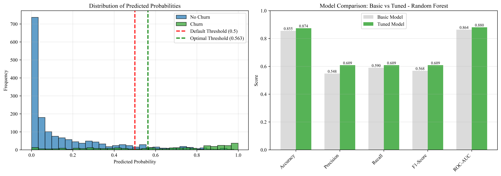
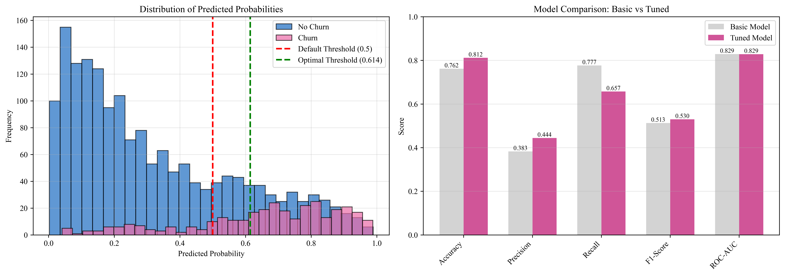
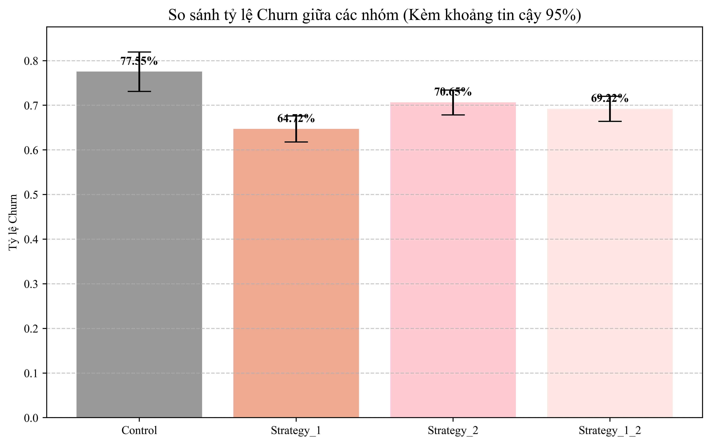

# I. **PROJECT OVERVIEW (Giả lập Doanh nghiệp MoMo)**

## 1. Business Introduction 
MoMo (ví điện tử) là siêu ứng dụng tài chính hàng đầu tại Việt Nam, thành lập năm 2007. Với hơn 31 triệu người dùng và hệ sinh thái liên kết trên 90% ngân hàng, MoMo cung cấp các dịch vụ thanh toán, chuyển tiền, mua sắm và đầu tư, giữ vị trí thống lĩnh trong lĩnh vực Fintech. 

MoMo hoạt động như một "trợ thủ tài chính" giúp người Việt dễ dàng chi tiêu, quản lý và đầu tư.
## 2. Problem Statement 
MoMo thường gặp khó khăn trong việc xác định các rủi ro tiềm ẩn liên quan đến việc khách hàng ngừng sử dụng dịch vụ (churn), đặc biệt khi các dấu hiệu rời bỏ chỉ xuất hiện rõ ràng khi khách hàng đã không còn hoạt động. Việc dự đoán churn trong tương lai là rất quan trọng để tối ưu hóa kết quả tài chính và giữ chân khách hàng. Hiểu rõ hành vi sử dụng, các yếu tố nhân khẩu học và hoạt động giao dịch của khách hàng cho phép doanh nghiệp đưa ra các quyết định sáng suốt về chiến lược marketing cá nhân hóa và thiết kế các chương trình giữ chân phù hợp.

## 3. Objective 
Xây dựng một hệ thống phân tích dữ liệu nhằm **dự đoán churn** và hỗ trợ ra quyết định marketing dựa trên dữ liệu, từ đó giảm tỷ lệ rời bỏ và tối ưu hóa giá trị khách hàng.

# II. 🚀 **QUY TRÌNH THỰC HIỆN**

Bước 1: Khám Phá Dữ Liệu (EDA)

* Trực quan hóa phân phối đơn/đa biến **(Univariate/Bivariate Analysis)** và đa biến **(Multivariate/Scatterplot Matrix)** nhằm phát hiện các biến tương quan mạnh với hành vi rời đi của khách hàng.

* Thực hiện **Encode** các biến phân loại và **Scale** dữ liệu chuẩn hóa phục vụ mô hình toán học.

Bước 2: Xây Dựng & Tối Ưu Mô Hình Dự Đoán (Predictive Modeling)

* Áp dụng kỹ thuật **Oversampling (SMOTE)** lấy mẫu lại dữ liệu để cân bằng trọng số giữa các nhóm **Imbalanced Data**

* Thử nghiệm song song hai thuật toán phân lớp phổ biến. Được tinh chỉnh siêu tham số qua `GridSearchCV` và tối ưu hóa lại ngưỡng phân loại `Threshold`:
    1. **Logistic Regression:** 

    2. **Random Forest Classifier:** 
* Đánh giá hiệu năng tổng thể của mô hình thông qua bộ chỉ số: Accuracy, Precision, Recall, F1-score và đường cong ROC-AUC.

Bước 3: Thiết Kế Thử Nghiệm **A/B Testing**
     
* Áp dụng mô hình có hiệu năng tốt nhất (Logistic Regression tuned) lên tập khách hàng đang hoạt động để dự báo xác suất rời bỏ (`churn_prob`).
* Thực hiện chia nhóm ngẫu nhiên để triển khai thử nghiệm **A/B Testing** nhằm đo lường hiệu quả thực tế của 3 chiến lược Marketing giữ chân khác nhau:
  * **Strategy 1 (Kích hoạt lại giao dịch):** Tập trung đánh vào biến `Total_Transaction`. Tặng voucher ưu đãi đi kèm điều kiện khách hàng phải phát sinh tối thiểu 3 giao dịch/tuần nhằm thiết lập lại thói quen mở app.
  * **Strategy 2 (Đánh thức khách hàng ngủ đông):** Tập trung đánh vào biến `Months_Inactive`. Gửi thông báo và quà tặng cá nhân hóa ngay khi khách hàng có dấu hiệu ngừng tương tác từ 2 tháng trở lên.
  * **Strategy 1+2:** Kết hợp đồng thời cả hai chương trình ưu đãi trên cùng một nhóm khách hàng.
  * **Control Group (Nhóm đối chứng):** Nhóm khách hàng nguy cơ cao nhưng giữ nguyên, hoàn toàn không tác động bất kỳ chiến dịch Marketing nào.
* Áp dụng kiểm định thống kê **Chi-square (Chi-square Contingency Test)** kết hợp hiệu chỉnh Bonferroni để xác định xem sự sụt giảm tỷ lệ rời bỏ ở các nhóm tác động có thực sự mang ý nghĩa thống kê hay không.

# III. **Kết quả (Key Results)**

### 1. Hiệu năng Mô hình Dự đoán
* **Mô hình Random Forest Tuned:** Đạt hiệu năng vượt trội với điểm Cross-validation AUC đạt **0.88**. 

* **Mô hình Logistic Regression Tuned:** Sau khi được tối ưu hóa lại ngưỡng phân loại, mô hình đã cải thiện đáng kể so với phiên bản gốc:
  * *Accuracy (Độ chính xác tổng thể):* Tăng từ 76.21% lên **81.19%**.
  * *Precision (Độ chính xác phân loại):* Tăng từ 38.31% lên **44.42%**.
  * *Recall (Khả năng bắt trúng khách churn):* Giữ ở mức ổn định cao, giúp tối ưu hóa điểm F1-score tổng thể và hạn chế việc bỏ sót khách hàng sắp rời bỏ.

### 2. Hiệu quả Chiến dịch Giữ chân khách hàng (A/B Testing)
Kết quả kiểm định Chi-square (với P-value < 0.05) khẳng định các chiến dịch Marketing có tác động làm thay đổi rõ rệt tỷ lệ churn thực tế của người dùng:

* **Strategy 1 (Thúc đẩy giao dịch) - Chiến dịch xuất sắc nhất:**
  * Giúp kéo giảm tỷ lệ rời bỏ thực tế từ **77.55%** (ở nhóm Control không tác động) xuống chỉ còn **64.72%**.
  * Mang lại mức giảm tuyệt đối **12.83%** (Nghĩa là cứ mỗi 100 khách hàng nguy cơ cao được nhận chiến dịch này, MoMo cứu vãn thành công thêm khoảng 13 người so với việc bỏ mặc không hành động).

* **Strategy 2 (Nhắc nhở khách ngủ đông) - Hiệu quả ở mức nhẹ:**
  * Có làm giảm tỷ lệ churn so với nhóm Control, tuy nhiên khoảng sai số của nhóm này bị chồng lấp nhẹ với dải dưới của nhóm đối chứng. Chiến dịch này mang lại hiệu quả nhưng biên độ tác động không mạnh mẽ bằng Strategy 1.

* **Strategy 1 + 2 (Tác động kép) - Phản tác dụng:**
  * Nhóm nhận cả hai chiến dịch đạt tỷ lệ churn là **69.22%**. Mặc dù kết quả này vẫn tốt hơn việc không làm gì (nhóm Control - 77.55%), nhưng lại **kém hiệu quả hơn rõ rệt** so với việc chỉ áp dụng đơn lẻ chiến dịch thúc đẩy giao dịch Strategy 1 (64.72%).
  * *Bài học kinh nghiệm:* Việc dồn dập gửi quá nhiều thông báo hoặc ép khách hàng thực hiện quá nhiều điều kiện khuyến mãi cùng một lúc dễ gây tác dụng ngược, làm khách hàng cảm thấy bị làm phiền, từ đó giảm hiệu suất giữ chân.

# 📁 Các file có trong dự án này
* `EDA.ipynb`: File notebook dùng để phân tích, trực quan hóa và khám phá các đặc trưng ban đầu của tập dữ liệu.
* `training_model.ipynb`:  File notebook thực hiện việc huấn luyện, thử nghiệm và tối ưu hóa (tuning) các siêu tham số cho mô hình dự báo.
* `clustering.ipynb`:File notebook chứa mã nguồn phân cụm khách hàng để dự đoán tỷ lệ rời bỏ (churn) và đánh giá hiệu quả của các chiến dịch tác động. 
* `best_lr_model.pkl`: Tập tin lưu trữ mô hình hồi quy Logistic (Logistic Regression) đã được huấn luyện và tối ưu hóa hoàn chỉnh 
* `chart_style.py`: Định nghĩa các hàm cấu hình giao diện, màu sắc và phong cách thiết kế đồng bộ cho các biểu đồ trong dự án.
* `data_pipeline.py`: Chứa các hàm xử lý tự động từ bước thu thập, làm sạch cho đến tiền xử lý dữ liệu thô
* `data_raw.csv`: Tệp tin định dạng CSV lưu trữ toàn bộ dữ liệu gốc chưa qua xử lý của dự án
* `Churn_Customer.pdf`: Báo cáo hoàn chỉnh bằng file PDF tổng hợp các kết quả phân tích, thông tin chuyên sâu và đề xuất về tình trạng rời bỏ của khách hàng.
* `README.md`: Tài liệu hướng dẫn bằng ngôn ngữ Markdown giới thiệu tổng quan về mục tiêu, cấu trúc và cách khởi chạy dự án.
# Thứ tự thực hiện 
1. `EDA.ipynb`
2. `training_model.ipynb`
3. `clustering.ipynb`
